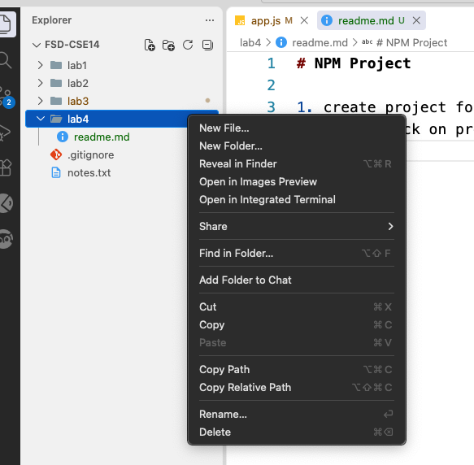
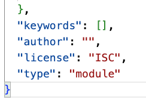
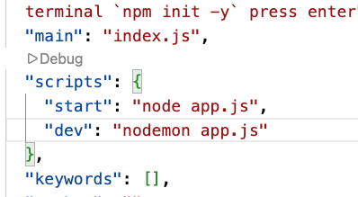

# NPM Project

1. create project folder
2. right click on project folder and select open integrated terminal
   
3. type in terminal `npm init -y` press enter
4. open package.json file from project folder
5. update type as `type:module` in package.json
   
6. type in terminal `npm i nodemon -D` to install nodemon, which restarts server while file changes. -D flag indicate install as dev dependency
7. it cretes node_modules folder and package-lock.json
8. udpate .gitignore file and write project-folder/node_modules
9. update package.json to run the project, update script property as below
   
   ```
   "scripts": {
    "start": "node app.js",
    "dev": "nodemon app.js"
   },
   ```
10. now you can start the server by typing `npm run dev` in the terminal of project folder
